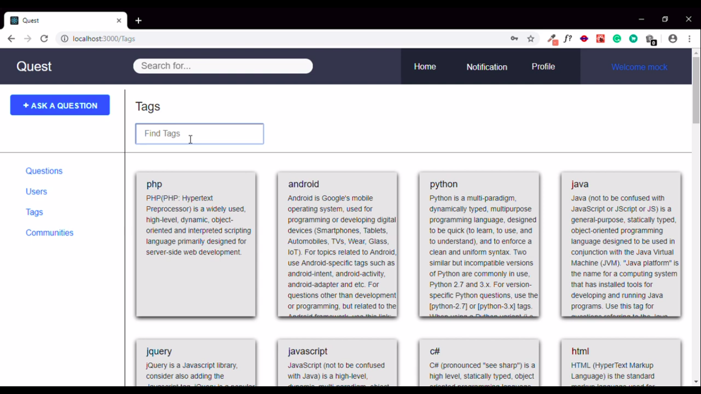

# Quest

Its an ML powered Q&amp;A forum where a user can ask questions which will be answered by users specialized in that particular category.
The tags to which the question belongs is automatically generated by the ML model to ensure that the question reaches the right audience. 
Users can also create communities for their college or workspace. Users who actively participate in discussions are given points according
to their involvement, which can later help them in the job market.
Technologies used: ReactJS, NodeJS, Flask, Tensorflow
Watch the working of the project!!
https://youtu.be/luJIoIBRCbc

LOGIN PAGE 

HOME PAGE

PROFILE PAGE

ADD QUESTIONS

SHARE

TAG GENERATION USING MACHINE LEARNING

TAGS SEARCH

VERIFIED BY ADMIN

